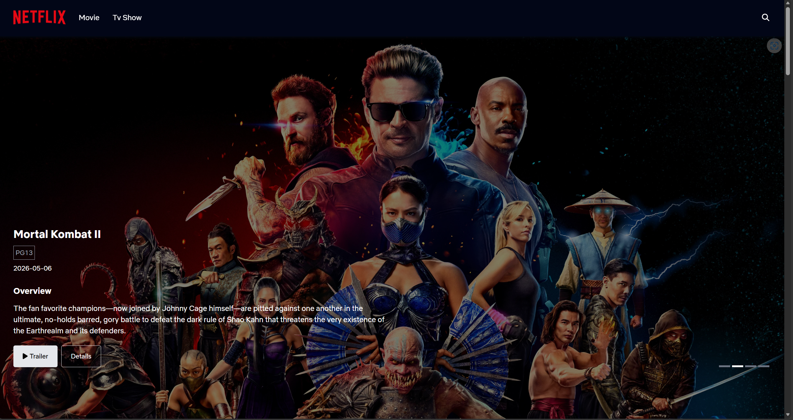
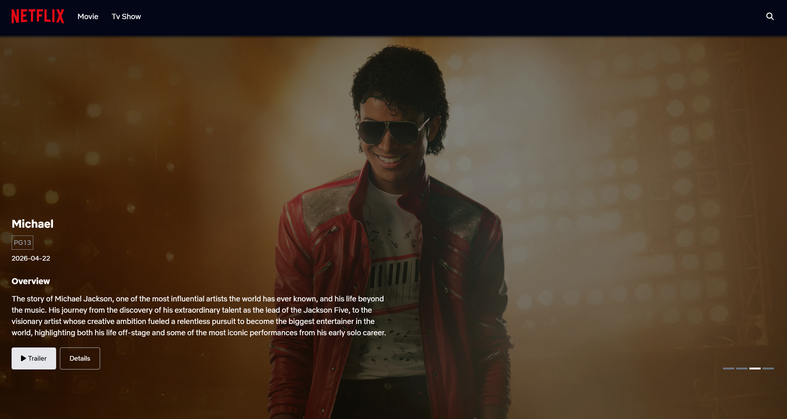

<p>&nbsp;</p>
<p align="center">
  
<p />

<p align="center">
  
  
</p>

<p align="center">
  <b>Buid With</b>
</p>

<p align="center">
  
  
  
  
</p>
<p align="center">⭐ Star me on GitHub — your support motivates me a lot! (´▽`ʃ♡ƪ)</p>

---

## ➡️ [Demo Here](https://movie-app-liard-nine-55.vercel.app/)

## 📌 Table of Contents
* [💫 About](#about)
* [✨ Features](#feature)
  * [🎬 Browse Movies & TV Shows](#movie-tv-show)
  * [🔍 Advanced Search & Filter](#search)
  * [📄 Detailed Information Pages](#detail)
  * [🎥 Watch Trailers](#watch)
  * [📱 Responsive UI/UX](#responsive)
* [📦 Installation & Setup](#setup)
* [✍️ Author](#author)
* [📜 License](#license)

## <a id="about"></a>💫 About ECV
<p>
  
  
  <strong>The Movie App</strong> is  A modern, smooth-running web application that allows users to easily browse, search
for and discover blockbuster lms and popular TV programmes using data from the TMDB API. The
project has been optimised for performance and user interface using the latest technologies.
</p>

## <a id="feature"></a> ✨ Features

### <a id="movie-tv-show"></a> 🎬 Browse Movies & TV Shows
- Discover trending and top-rated content with category tabs
- Auto-rotating banner showcasing popular movies with trailers
### <a id="search"></a> 🔍 Advanced Search & Filter
- Filter by media type (Movie/TV Show), genres, and rating range
- Real-time search results with grid display
### <a id="detail"></a> 📄 Detailed Information Pages
- Complete movie/TV show details with cast, crew, and ratings
- Season information for TV shows with episode counts
- Actor profiles with biography and filmography
### <a id="watch"></a> 🎥 Watch Trailers
- One-click YouTube trailer playback in modal popup
- Available on homepage banner and detail pages
### <a id="responsive"></a> 📱 Responsive UI/UX
- Netflix-inspired dark theme with smooth animations
- Color-coded rating system (circular progress bars)
- Mobile-first responsive design across all devices


## <a id="setup"></a> 📦 Installation & Setup

Follow these instructions to get a copy of the project up and running on your local machine for development and testing purposes.

### <a id="prer"></a> 📋 Prerequisites
Before you begin, ensure you have the following installed:
* [Git](https://git-scm.com/)
* [Node.js](https://nodejs.org/) (v18.0.0 or higher recommended) & (npm/bun)

### 📥 Clone the Repository
```bash
git clone git@github.com:lhnhidev/movie-app.git
```

Create a `.env` file in the directory with the following content:
```bash
# TMDB API Configuration
VITE_HOST=https://api.tmdb.org/3/

# You can get token here: https://developer.themoviedb.org/docs/getting-started
VITE_API_TOKEN=<your-token-tmdp>
```

You can use `bun` rather than `npm` to run the project.
``` bash
# Start app
# Via the local URL provided in your terminal http://localhost:5173
bun run dev
```

### 🎉 Result

If configured successfully, after about 1-3 minutes, you will see an interface like this:



## <a id="contributing"></a> 🤝 Contributing

Contributions are what make the open-source community such an amazing place to learn, inspire, and create. Any contributions you make are **greatly appreciated**.

If you have a suggestion that would make this better, please fork the repo and create a pull request. You can also simply open an issue with the tag "enhancement".

1. Fork the Project
2. Create your Feature Branch (git checkout -b feature/amazing-feature)
3. Commit your Changes using Conventional Commits format
```bash
git commit -m '<type>(<scope>): <description>'
```
4. Push to the Branch (git push origin feature/amazing-feature)
5. Open a Pull Request

## <a id="author"></a> ✍️ Author


Le Hoang Nhi - Initial work & Lead Developer - @lhnhidev

You can also connect with me via [LinkedIn](https://www.linkedin.com/in/nhi-l%C3%AA-021188324/) or lhnhi420@gmail.com

## <a id="license"></a>  📜 License
Distributed under the MIT License. See [LICENSE](./LICENSE) file in the repository for more information.

## <a id="feedback"></a> 💖 Feedback & Support

If you love using this project, please consider giving me a star on GitHub! ⭐

- Found a bug? Open an Issue on my repository.

- Have a feature request? I would love to hear it! Start a Discussion or drop an issue.

- Want to contribute? I welcome PRs!

---

<div align="center">
  
</div>

<p align="center">✨ Your feedback and stars help keep this project growing ✨</p>